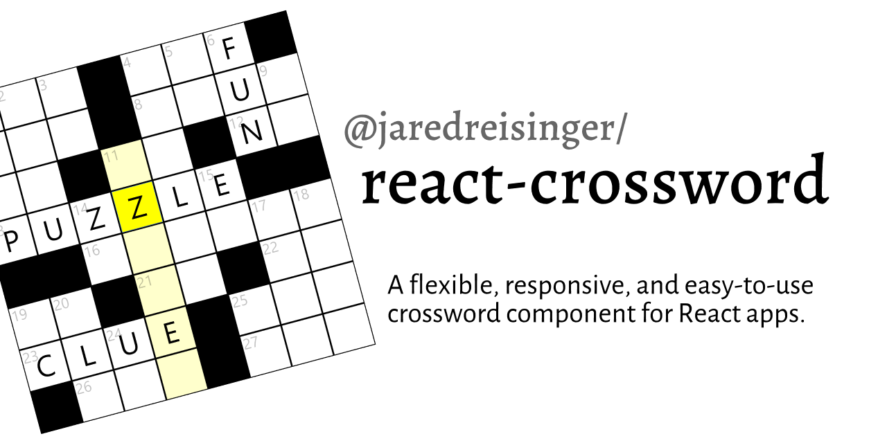

# 

[](https://www.npmjs.com/package/@jaredreisinger/react-crossword)
[](https://travis-ci.org/JaredReisinger/react-crossword)
[](https://codecov.io/gh/JaredReisinger/react-crossword)<br />
[](https://snyk.io/test/github/JaredReisinger/react-crossword?targetFile=package.json)
[](https://david-dm.org/JaredReisinger/react-crossword)
[](https://david-dm.org/JaredReisinger/react-crossword?type=dev)
[](https://david-dm.org/JaredReisinger/react-crossword?type=peer)<br />
[](./LICENSE)

[](http://commitizen.github.io/cz-cli/)
[](https://github.com/semantic-release/semantic-release)

## Install

```sh
npm install --save @jaredreisinger/react-crossword
  # or #
yarn add @jaredreisinger/react-crossword
```

## Usage

> See also the [styleguidist docs for Crossword](https://jaredreisinger.github.io/react-crossword/).

```javascript
import React from 'react';

import Crossword from '@jaredreisinger/react-crossword';

const data = {
  /* ... puzzle data (see below) ... */
};

export default function MyPage() {
  return <Crossword data={data} />;
}
```

### Clue/data format

To make crosswords as easy to create as possible, with the least amount of extraneous and boilerplate typing, the clue/answer format is structured as a set of nested objects:

```javascript
const data = {
  across: {
    1: {
      clue: 'one plus one',
      answer: 'TWO',
      x: 0,
      y: 0,
    },
  },
  down: {
    2: {
      clue: 'three minus two',
      answer: 'ONE',
      x: 2,
      y: 0,
    },
  },
};
```

At the top level, the `across` and `down` properties group together the clues/answers for their respective directions. Each of those objects is a map, keyed by the answer number rather than an array. (This is done so that the creator has control over the numbering/labelling of the clues/answers.) Each item contains a `clue` and `answer` property, as well as `row` and `col` for the starting position.

The `Crossword` component calculates the needed grid size from the data itself, so you don't need to pass an overall size to the component.

## Styling

One other major difference (and advantage) to this crossword component is that it is very "stylable"... as many of the styling properties as possible are exposed so that you can create any look you want for the crossword. The `Crossword` component offers the following properties to control colors and layout:

| property              | default               | description                                                                                                                                                                 |
| --------------------- | --------------------- | --------------------------------------------------------------------------------------------------------------------------------------------------------------------------- |
| `columnBreakpoint`    | `'768px'`             | browser-width at which the clues go from showing beneath the grid to showing beside the grid.                                                                               |
| `gridBackground`      | `'rgb(0,0,0)'`        | overall background color (fill) for the crossword grid. Can be `'transparent'` to show through a page background image.                                                     |
| `cellBackground`      | `'rgb(255,255,255)'`  | background for an answer cell                                                                                                                                               |
| `cellBorder`          | `'rgb(0,0,0)'`        | border for an answer cell                                                                                                                                                   |
| `textColor`           | `'rgb(0,0,0)'`        | color for answer text (entered by the player)                                                                                                                               |
| `numberColor`         | `'rgba(0,0,0, 0.25)'` | color for the across/down numbers in the grid                                                                                                                               |
| `focusBackground`     | `'rgb(255,255,0)'`    | background color for the cell with focus, the one that the player is typing into                                                                                            |
| `highlightBackground` | `'rgb(255,255,204)'`  | background color for the cells in the answer the player is working on, helps indicate in which direction focus will be moving; also used as a background on the active clue |

Also, several class names are applied to elements in the crossword, in case you
want to apply styles that way:

| element                                                 | class name  |
| ------------------------------------------------------- | ----------- |
| entire crossword component; encompassing grid and clues | `crossword` |
| answer grid                                             | `grid`      |
| all of the clues                                        | `clues`     |
| header and clues for one direction                      | `direction` |
| direction header ('across' or 'down')                   | `header`    |
| an individual clue                                      | `clue`      |

(No class names are currently applied within the grid, as the SVG layout is very
layout-sensitive.)

## Player progress events

In addition to providing properties for styling, there are some properties to
help your application "understand" the player's progress:

| property          | description                                                                                                                                                                                                                                                |
| ----------------- | ---------------------------------------------------------------------------------------------------------------------------------------------------------------------------------------------------------------------------------------------------------- |
| `useStorage`      | whether to use browser storage to persist the player's work-in-progress (`true` by default)                                                                                                                                                                |
| `onCorrect`       | callback function that fires when a player answers a clue correctly; called with `(direction, number, answer)` arguments, where `direction` is `'across'` or `'down'`, `number` is the clue number as text (like `'1'`), and `answer` is the answer itself |
| `onLoadedCorrect` | callback function that's called when a crossword is loaded, to batch up correct answers loaded from storage; passed an array of the same values that `onCorrect` would recieve                                                                             |

## Background

Initially written as a replacement for `@guardian/react-crossword`, to make custom styling and puzzle-definition easier.

There are several things about the Crossword component from `@guardian/react-crossword` that are less than ideal, in my opinion:

- the styles/formatting are baked in
- semi-unrelated functionality like the "anagram helper" is baked in
- the data format for clues/answers is horrendous

This is an attempt to create a less-opinionated component that's much easier to drop in to an arbitrary React page.

## License

[MIT](./LICENSE), © 2020 [Jared Reisinger](https://github.com/JaredReisinger)
